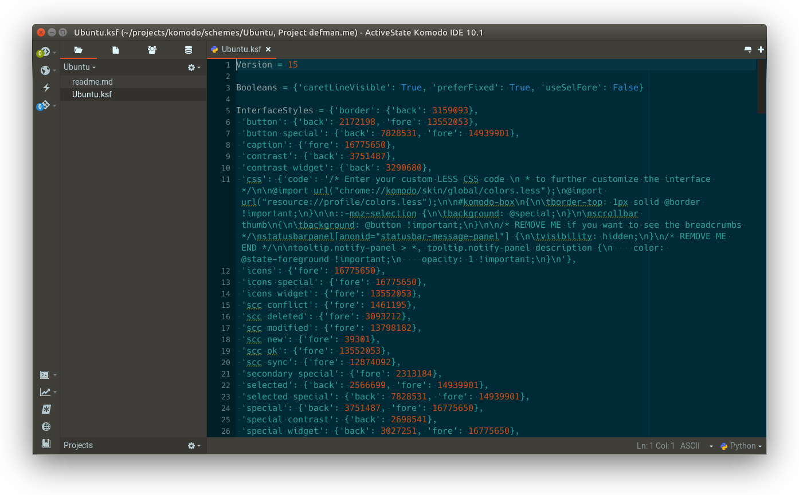

Kobuntu
=======

An Ubuntu-like Interface colors for Komodo X.

You can use any colors you want for the editor, see Prefs - Appearance.

If you want to see the breadcrumbs, open Color Scheme Editor - Interface, and
remove everything inside `/* REMOVE ME */` block.

